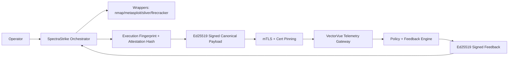

<!-- NYXERA_BRANDING_HEADER_START -->

  

  <a href="https://docs.spectrastrike.nyxera.cloud">Docs</a> |
  <a href="https://spectrastrike.nyxera.cloud">SpectraStrike</a> |
  <a href="https://nexus.nyxera.cloud">Nexus</a> |
  <a href="https://nyxera.cloud">Nyxera Labs</a>

<!-- NYXERA_BRANDING_HEADER_END -->

<!--
Copyright (c) 2026 NyxeraLabs
Author: Jose Maria Micoli
Licensed under BSL 1.1
Change Date: 2033-02-22 -> Apache-2.0
-->

# SpectraStrike

SpectraStrike is the execution and telemetry control plane for authorized offensive security validation. It runs tools, binds executions to operator and policy context, and emits signed/attested telemetry into VectorVue.

## What Problem It Solves

Security teams need repeatable execution evidence, not screenshots and manual notes. SpectraStrike turns tool output into policy-bound, cryptographically signed telemetry that can be trusted by downstream analytics and audit systems.

## Architecture

## Quick Start

1. `cd SpectraStrike`
2. `make local-federation-up`
3. `make host-integration-smoke-full`
4. `ls -la local_docs/audit`
5. Open VectorVue and verify accepted telemetry/finding state.

## Screenshots

- `docs/screenshots/spectrastrike-dashboard.png` (placeholder)
- `docs/screenshots/spectrastrike-execution-graph.png` (placeholder)
- `docs/screenshots/spectrastrike-feedback-loop.png` (placeholder)

## See Results

- E2E audit report: `docs/E2E_EXECUTION_AUDIT_REPORT.md`
- Latest audit log: `local_docs/audit/final-e2e-asymmetric-*.log`
- Federation docs: `docs/FULL_FEDERATION_INTEGRATION.md`

## Security Guarantees

- mTLS is mandatory for federation transport.
- Client certificate pinning is enforced.
- Telemetry ingress rejects redirects and unsigned payloads.
- Schema version checks are enforced for canonical payloads and cognitive graph payloads.
- Replay protection uses nonce + timestamp windows.
- Signature verification failures are fail-closed.
- Operator-to-tenant mapping is enforced server-side.

## Federation Overview

- SpectraStrike signs outbound telemetry with Ed25519.
- VectorVue verifies signatures before accepting telemetry.
- VectorVue signs feedback responses with Ed25519 (`kid` + rotation support).
- SpectraStrike verifies feedback signatures and rejects unsigned/replayed/unknown-key responses.

## Attested Execution (Plain Language)

Each execution carries an `attestation_measurement_hash` that represents measured runtime state. That hash is embedded in telemetry, fingerprints, findings, and policy input, and is part of what gets signed. If someone changes the attestation hash, signature verification fails and the payload is rejected.

## Documentation

- End-user guide: `docs/END_USER_GUIDE.md`
- SDK developer guide: `docs/SDK_DEVELOPER_GUIDE.md`
- Full federation integration: `docs/FULL_FEDERATION_INTEGRATION.md`
- Roadmap: `docs/ROADMAP.md`

## License

Business Source License 1.1. See `LICENSE`.

<!-- NYXERA_BRANDING_FOOTER_START -->

---

  

  2026 SpectraStrike by Nyxera Labs. All rights reserved.

  <a href="https://docs.spectrastrike.nyxera.cloud">Docs</a> |
  <a href="https://spectrastrike.nyxera.cloud">SpectraStrike</a> |
  <a href="https://nexus.nyxera.cloud">Nexus</a> |
  <a href="https://nyxera.cloud">Nyxera Labs</a>

<!-- NYXERA_BRANDING_FOOTER_END -->
