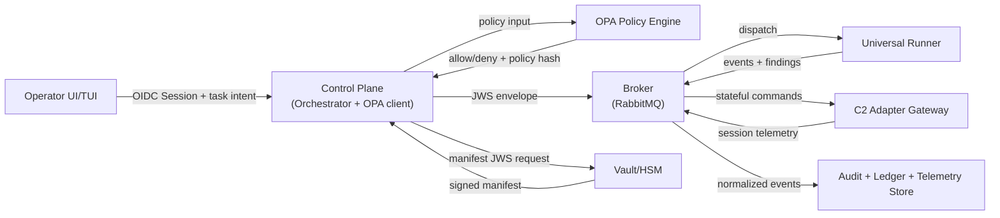

<!--
Copyright (c) 2026 NyxeraLabs
Author: José María Micoli
Licensed under BSL 1.1
Change Date: 2033-02-22 -> Apache-2.0
-->

# SpectraStrike Threat Model v1.0 (Sprint 18)

## 1. Scope

This model formalizes threat coverage for Phase 5.5 across four primary planes:
- Control Plane (API, Orchestrator, OPA client, signing workflows)
- Runner Plane (Universal Runner, execution isolation, telemetry emission)
- C2 Adapter Plane (stateful adapters and translation bridges)
- Key and Secret Plane (Vault/HSM key material, policy bundles, signed config)

Methodology: STRIDE (Spoofing, Tampering, Repudiation, Information Disclosure, Denial of Service, Elevation of Privilege).

## 2. Trust Boundary Diagram

Trust boundaries:
- Boundary A: Untrusted human input into Control Plane.
- Boundary B: Potentially compromised message transport and edge runtime.
- Boundary C: Cryptographic root of trust (Vault/HSM) separate from dispatch channel.
- Boundary D: Multi-tenant data segregation and audit storage boundaries.

## 3. Threat Scenarios by STRIDE

### 3.1 Malicious Operator Scenarios

- S1 (Spoofing): operator reuses stolen session token to submit high-risk task.
- T1 (Tampering): operator modifies task target after policy approval via client-side mutation.
- R1 (Repudiation): operator denies having approved ingest or break-glass path.
- I1 (Information Disclosure): operator attempts unauthorized read of other tenant evidence.
- D1 (Denial of Service): operator floods control APIs with rapid task submissions.
- E1 (Elevation of Privilege): operator attempts tool execution outside assigned capabilities.

### 3.2 Compromised Runner Scenarios

- S2 (Spoofing): rogue process impersonates runner identity to receive tasks.
- T2 (Tampering): attacker alters local execution payload after broker delivery.
- R2 (Repudiation): runner drops failures and reports only successful telemetry.
- I2 (Information Disclosure): runner exfiltrates telemetry payloads outside allowlist.
- D2 (Denial of Service): runner abuse causes queue starvation or stuck consumers.
- E2 (Elevation of Privilege): runner escapes runtime policy and pivots laterally.

### 3.3 Supply-Chain Compromise Scenarios

- S3 (Spoofing): forged tool image identity in registry path.
- T3 (Tampering): mutated dependency or container layer post-approval.
- R3 (Repudiation): no attributable chain for who approved changed artifact.
- I3 (Information Disclosure): malicious dependency leaks secrets at build/runtime.
- D3 (Denial of Service): poisoned dependency blocks reproducible build/test flow.
- E3 (Elevation of Privilege): signed pipeline token is abused for unrestricted release.

### 3.4 Cross-Tenant Escalation Scenarios

- S4 (Spoofing): tenant context token replayed across tenant boundaries.
- T4 (Tampering): tenant_id stripped or replaced in task/telemetry channel.
- R4 (Repudiation): tenant admin disputes origin of cross-tenant access.
- I4 (Information Disclosure): query path bypasses tenant filter and leaks findings.
- D4 (Denial of Service): one tenant saturates shared broker resources.
- E4 (Elevation of Privilege): policy gap allows tenant-scoped role to execute global action.

## 4. Threat-to-Mitigation Mapping

| Threat IDs | Primary mitigations in code/architecture |
| --- | --- |
| S1, E1, E4 | AAA role gates (`src/pkg/security/aaa_framework.py`), OPA capability policy (`config/opa/policies/capabilities.rego`) |
| T1, T2, T4 | JWS manifest signing and verification (`src/pkg/orchestrator/jws.py`, `src/pkg/runner/jws_verify.py`) |
| R1, R2, R3, R4 | Audit trail chain (`src/pkg/orchestrator/audit_trail.py`), legal governance controls (`src/pkg/governance/legal_enforcement.py`) |
| I1, I4 | Tenant-aware request guards and authorization checks (`ui/web/app/lib/request-guards.ts`, `ui/web/app/lib/auth-store.ts`) |
| D1, D2, D4 | Queue-based async dispatch and bounded retry semantics (`src/pkg/orchestrator/messaging.py`, `src/pkg/orchestrator/event_loop.py`) |
| I2, E2 | Runner network policy fencing (`src/pkg/runner/network_policy.py`) and signature checks (`src/pkg/runner/jws_verify.py`) |
| S3, T3, I3, E3 | Supply-chain controls (SBOM/signature scripts in `docker/scripts/security/`) and Armory authorization checks (`src/pkg/armory/service.py`) |
| D3 | QA blocker recording and deterministic CI checks (`docs/manuals/QA_RUNBOOK.md`, `tests/qa/test_docs_qa.py`) |

## 5. Residual Risk Backlog Link

Unresolved risks and required remediations are tracked in:
- `docs/RISK_BACKLOG.md` (formal backlog entries for Sprint 18)

## 6. Threat Model Status

- STRIDE model coverage: complete for Control, Runner, C2 Adapter, Vault/HSM trust boundaries.
- Sprint status: Sprint 18 threat model tasks complete except final Git commit handoff.
