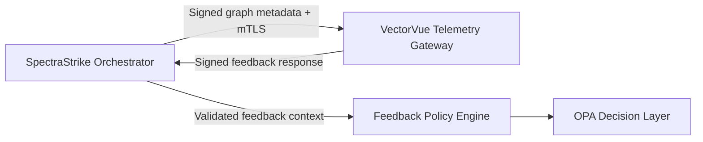

<!-- NYXERA_BRANDING_HEADER_START -->

  

  <a href="https://docs.spectrastrike.nyxera.cloud">Docs</a> |
  <a href="https://spectrastrike.nyxera.cloud">SpectraStrike</a> |
  <a href="https://nexus.nyxera.cloud">Nexus</a> |
  <a href="https://nyxera.cloud">Nyxera Labs</a>

<!-- NYXERA_BRANDING_HEADER_END -->

<!--
Copyright (c) 2026 NyxeraLabs
Author: Jose Maria Micoli
Licensed under BSL 1.1
Change Date: 2033-02-22 -> Apache-2.0
-->

# SpectraStrike VectorVue Cognitive Loop Integration

## Scope

Sprint 31 cognitive loop alignment over the internal zero-trust federation channel.

## Endpoints

- `POST /internal/v1/cognitive/execution-graph`
- `POST /internal/v1/cognitive/feedback/adjustments/query`

## Security Contract

- mTLS service identity required (`X-Service-Identity`, `X-Client-Cert-Sha256`)
- Ed25519 request signature required (`X-Telemetry-Timestamp`, `X-Telemetry-Nonce`, `X-Telemetry-Signature`)
- Replay protection required (timestamp skew + nonce uniqueness)
- Feedback response signature required (HMAC-SHA256)
- Feedback replay protection required (`signed_at` window + response nonce uniqueness)

## Feedback Schema

Each feedback item must include:

- `tenant_id`
- `execution_fingerprint`
- `target_urn`
- `action`
- `confidence`
- `rationale`
- `timestamp`
- `schema_version`

Cognitive requests must include `operator_id`; VectorVue enforces operator-to-tenant mapping for tenant boundary control.

## Architecture Diagram

<!-- NYXERA_BRANDING_FOOTER_START -->

---

  

  2026 SpectraStrike by Nyxera Labs. All rights reserved.

  <a href="https://docs.spectrastrike.nyxera.cloud">Docs</a> |
  <a href="https://spectrastrike.nyxera.cloud">SpectraStrike</a> |
  <a href="https://nexus.nyxera.cloud">Nexus</a> |
  <a href="https://nyxera.cloud">Nyxera Labs</a>

<!-- NYXERA_BRANDING_FOOTER_END -->
