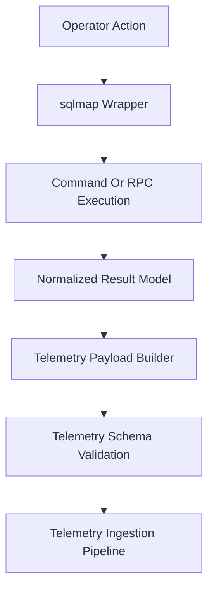

<!--
Copyright (c) 2026 NyxeraLabs
Author: Jose Maria Micoli
Licensed under BSL 1.1
Change Date: 2033-02-22 -> Apache-2.0
-->

# sqlmap Wrapper Architecture

```mermaid
flowchart TD
    A[Operator Action] --> B[sqlmap Wrapper]
    B --> C[Command Or RPC Execution]
    C --> D[Normalized Result Model]
    D --> E[Telemetry Payload Builder]
    E --> F[Telemetry Schema Validation]
    F --> G[Telemetry Ingestion Pipeline]
```
